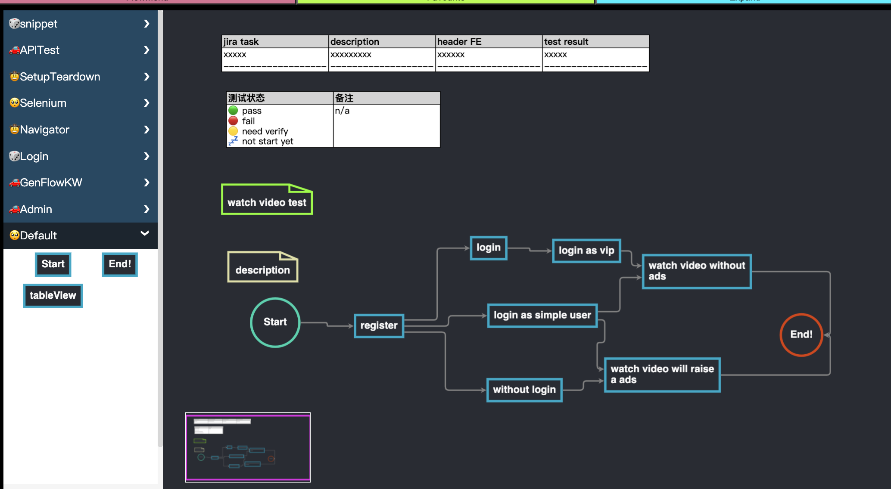

# I've been there. Constant feature changes. Complex workflows. The headache of updating automation scripts for every little tweak. It's enough to make you question if automation is worth it.

# flowjs
## snap, flow to control test design/automation/execution

# tablejs
## snap, RPA test case editor + runner

